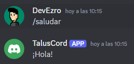

# 🤖 DISCORD BOT
>[!NOTE] Esto es solo un pequeño ejemplo de como funciona un bot en discord.
Con un poco de investigación y programación se puede llegar a realizar varias funciones que el paquete de Discord ofrece

## ✨ Como crear y configurar
>[!TIP] 
Recomendable crear un repositorio de GIT

## 📚 Requisitos
  - Cuenta de Discord y un servidor
  - Python3.13 y PiP

## 🐾 Pasos
### 1️⃣ Iniciar sesión en [Discord Developer Portal](https://discord.com/login?redirect_to=%2Fdevelopers%2Fapplications) 
>[!NOTE] Aquí entra también tener listo el servidor de Discord
- Pulsar en "New Application" y dar un nombre al Bot
- En el dashboard, en el menú de la izda., acceder a `OAuth2`:
  - En `OAuth2 URL Generator`, en el panel `Scopes`, marcar la casilla `bot`.
  - Se habilita debajo otro panel similar, `Text Permissions`, donde se marcan las casillas `Send Messages` y `Read Message History`

### 2️⃣ Invitar al bot al servidor
- Copiar el enlace generado al final de la página, en `Generated URL` y pegar en la barra de URLs para invitar al bot a nuestro servidor
- Dejar marcadas las casillas de permisos que aparecen al invitar al bot al servidor

### 3️⃣ Desarrollo del bot
>[!TIP] Recomendable crear un entorno virtual
Ej: `python -m venv bot-enviroment`

- Instalar las dependencias con el fichero `requirements.txt`: `pip install -r requirements.txt`
- Manualmente:
```
pip install dotenv
pip install audioop-lts
pip install discord.py
pip install aiohttp
(pip install discord.py==1.7.3)
```

>[!WARNING] Es posible que a la hora de iniciar el bot haya problemas relacionados con los paquetes de pip debido a las dependencias y versiones de los mismos

- Crear un fichero `.env` para las variables de entorno, en concreto el token del bot:
  - En el menú de la izda. del dashboard, en la pestaña `Bot`, pulsar en el apartado `token`, `Reset Token`
  - Copiamos el token y lo pegamos en el fichero `.env` como valor para la variable `DISCORD_TOKEN=<token>`
- Creamos un fichero `bot.py` o `main.py`. Como se prefiera
  - Gracias al importar el paquete `dotenv`, podemos usar las variables de entorno del proyecto (en este caso el token en `.env`)
  - Para el desarrollo, seguir como ejemplo el fichero `bot.py`

### 4️⃣ Permisos del bot
- En el menú del dashboard, en la pestaña `Bot`, en el apartado `Privileged Gateway Intents`, activamos las tres opciones que aparecen:
  - `Presence intent`
  - `Server members intent`
  - `Message content intet`
- Creamos un canal de texto en el servidor:
  - En los ajustes del canal, accedemos a permisos y añadimos al bot
  - Le otorgamos los permisos de `Enviar mensajes` y `Leer historial de mensajes`
  
### 5️⃣ Ejecucción del bot
- Para terminar, ejecutamos el comando `python bot.py` para arrancar el bot
- Según el ejemplo del fichero `main/bot.py`, si escribimos en el canal de texto `/saludar`, nos debería responder con un `¡Hola!`:

  
